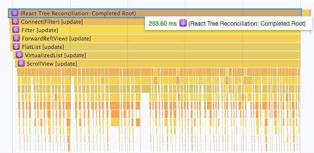

# How We Improved React Native List Performance by 5X

原文链接 https://hackernoon.com/how-to-improve-react-native-list-performance-5x-times-b299c8a23b5d

实现一个带有checkbox的列表界面，如下：


性能分析图如下：



(图片来自[原文](https://hackernoon.com/how-to-improve-react-native-list-performance-5x-times-b299c8a23b5d))

## 问题

这个列表有75个元素，但是在一屏内只有11个可见。所有我使用FlatList希望它可以只渲染当个变化的元素（最坏的情况渲染所有可见的元素），但是它**渲染了所有项**。

## 原来的方案

从redux state中取出`categories`，创建新的数组`extendedCategories`用来存储可见的categories

代码如下：

```	JavaScript
const Filter = ({ categories, selectedCategories, toggleCategory }) => {
  const extendedCategories = categories.map(c => ({
    ...c,
    isShown: selectedCategories.find(sc => sc.id === c.id),
  }))
  return (
    <View style={{ flex: 1 }}>
      <FlatList
        data={extendedCategories}
        keyExtractor={i => i.id}
        renderItem={({ item }) => (
          <FilterItem category={item} key={item.id} onClick={toggleCategory} />
        )}
      />
    </View>
  )
}

const connectedFilter = connect(
  state => ({
    categories: state.categories,
    selectedCategories: state.selectedCategories,
  }),
  { toggleCategory: actions.toggleSelectedCategory }
)(Filter)

export default connectedFilter
```
## 解决方案

只渲染发生变化的items，渲染时间可以减少5倍


(图片来自[原文](https://hackernoon.com/how-to-improve-react-native-list-performance-5x-times-b299c8a23b5d))

1. 使用categories作为数据源，在FlatList上动态计算isShown。

```JavaScript
const Filter = ({ categories, selectedCategories, toggleCategory }) => (
  <View style={{ flex: 1 }}>
    <FlatList
      data={categories}
      extraData={selectedCategories}
      keyExtractor={i => i.id}
      renderItem={({ item }) => (
        <FilterItem
          category={item}
          isShown={!!selectedCategories.find(sc => sc.id === item.id)}
          key={item.id}
          onClick={toggleCategory}
        />
      )}
    />
  </View>
)
```

2. 使用PureComponet

PureComponet和Component类似，不过它实现了shouldComponentUpdate()方法，渲染之前会浅显地比较prop和state来决定要不要进行渲染。

## Redux State

- `Categories`--一个数组保存所有分类信息
- `SelectedCategories`--保存选中的数据

```JavaScript
const filterReducer = handleActions(
  {
    [toggleSelectedCategory]: (state, { payload: { id, name } }) => {
      const categoryExists = state.selectedCategories.find(sc => sc.id === id)
      if (categoryExists) {
        return {
          ...state,
          selectedCategories: state.selectedCategories.filter(sc => sc.id !== id),
          }
        }

      return {
        ...state,
          selectedCategories: [{ id, name }, ...state.selectedCategories],
        }
    },
  },
  initialState.selectedCategories
)
```

## Profiling
使用Chrome Profiler进行性能分析


