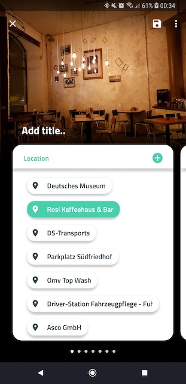
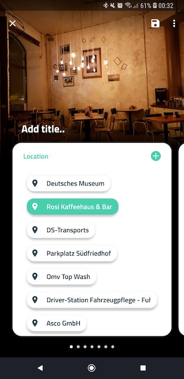

# StateListAnimator — a Powerful Little Tool for Elevation Animation

原文链接：https://proandroiddev.com/statelistanimator-a-powerful-little-tool-for-elevation-animation-4b31781e98a0

首先看下效果图:




头部视图的阴影部分随着视图的开始滑动显示。

## 实现
过去为了实现这样的效果，我会创建一个可观察的`ScrollView`，然后手动对`elevation`或者`shadow`执行动画。但是现在有一种更加简单地方法。

ScrollView和RecyclerView有一个属性：`canScrollVertically`。

我们可以简单监听滑动状态变化并且当视图滑动时收到通知。
代码如下：
```Java
scroll_view.setOnScrollChangeListener { _, _, _, _, _ ->
    header.isSelected = scroll_view.canScrollVertically(-1)
}
```
我真的不想直接传个-1作为参数，但是没有找到一个可以替代的常量。-1代表方向，表示向上滑动。

基于ScrollView（或者RecyclerView）是否可以滑动，来设置头部布局的`selected`属性。我们可以使用layout的`stateListAnimator`属性，当然应该还有更好的方法。

代码如下：
```Java
<FrameLayout
  android:id="@+id/header"
  android:layout_width="match_parent"
  android:layout_height="52dp"
  android:background="#ffffff"
  android:stateListAnimator="@animator/toolbar_elevation">
```

接下来是state list selector部分，定义了elevation transition。在res/animator目录下新建toolbar_elevation.xml文件，内容如下：

```Java
<?xml version="1.0" encoding="utf-8"?>
<selector xmlns:android="http://schemas.android.com/apk/res/android">

    <item android:state_selected="true">
        <objectAnimator
            android:duration="200"
            android:propertyName="elevation"
            android:valueTo="6dp"
            android:valueType="floatType" />
    </item>

    <item>
        <objectAnimator
            android:duration="200"
            android:propertyName="elevation"
            android:valueTo="0dp"
            android:valueType="floatType" />
    </item>

</selector>
```
使用`stateListAnimator`，Android系统已经为我们考虑许多边缘情况。

## 总结
今天的内容比较简单，有些过于简单了（偷笑）。主要就是监听可滑动的视图，然后设置`stateListAnimator`，相对于常用的selector的item是普通图片资源，stateListAnimator的item设置为`objectAnimator`，然后利用objectAnimator的`elevation`属性的值来实现阴影。
