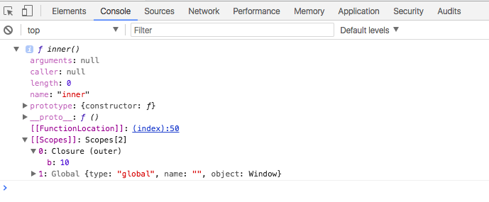

# A simple guide to help you understand closures in JavaScript

原文链接 https://medium.freecodecamp.org/javascript-closures-simplified-d0d23fa06ba4

从简单例子来理解JavaScirpt的闭包

闭包是我们耳熟能详的JavaScript概念之一，下面文章使用简单的列子来清楚阐述什么是闭包。

## What is a closure?

> A closure is a feature in JavaScript where an inner function has access to the outer (enclosing) function’s variables — a scope chain.

闭包的特性是内部函数可以访问外部函数的变量。

闭包有着三个作用域链：
- it has access to its own scope — variables defined between its curly brackets
- it has access to the outer function’s variables
- it has access to the global variables

即： 
- 它可以访问自己的作用域内变量
- 它可以访问外部函数的变量
- 它可以访问全局变量

对于缺乏经验的人，以上的定义中有太多专业术语。

## But what really is a closure?

那么闭包究竟是什么？

### A Simple closure

我们来看以下的列子：

```JavaScript
function outer() {
	var b = 10;
	
	function inner() {
		var a = 20;
		console.log(a+b);
	}

	return inner;
}

```

这里面有两个函数：

- 外部函数`outer`拥有变量`b`，并且返回`inner`函数
- 内部函数`inner`拥有变量`a`，并且可以访问变量`b`

变量`b`的作用域限制在`outer`函数内，变量`a`的作用域限制在`inner`函数内。
我们调用`outer()`函数，把结果存储在变量`X`，然后再调用一次`outer()`函数把结果存储在变量`Y`。

```JavaScript
function outer() {
	var b = 10;
	
	function inner() {
		var a = 20;
		console.log(a+b);
	}

	return inner;
}

var X = outer(); //outer() invoked the first time
var Y = outer(); //outer() invoked the second time

```
我们一步步看看第一次调用`outer()`函数发生了什么？

- 1. 变量`b`	被创建，并被赋值为10
- 2. 下一行是声明一个函数
- 3. 最后一行，返回inner，看起像是变量inner，实际是一个函数，所以返回`inner`函数的整个body体。  （Note: 这里需要注意的是，**return语句并没有执行inner函数，执行函数是需要在函数名后跟上()**
- 4. 所以变量`X`将存储以下部分：
	```JavaScript
	function inner() { 
	 var a=20; 
	console.log(a+b); 
	}
	``` 
- 5. `outer()`函数结束执行，所有在outer()函数作用域内的变量都将不存在。


一个变量的生命周期就是包含这个变量的函数执行的生命周期。

所以，当`outer()`再次调用时：
- 1. 一个新的变量`b`被创建，然后把被赋值为10，它的作用域限制在outer()函数内部
- 2. 下一行是声明一个函数
- 3. 返回inner整个body体
- 4. 变量`Y`存储inner整个body体
- 5. `outer()`函数结束执行，所有在outer()函数作用域内的变量都将不存在。

重要的一点是`outer()`函数再次调用的时候，会重新创建变量`b`。

让我们来看看变量`X`和变量`Y`，他们是函数，用以下方式验证下：

```JavaScript

console.log(typeof(X)); //X is of type function
console.log(typeof(Y)); //Y is of type function

```

因为变量X和变量Y是函数，我们可以执行他们。在变量名后跟上()，即是执行函数。比如X()和Y()。

```JavaScript

function outer() {
   var b = 10;
   function inner() {
        
         var a = 20; 
         console.log(a+b);
    }
   return inner;
}
var X = outer(); 
var Y = outer(); 
//end of outer() function executions
X(); // X() invoked the first time
X(); // X() invoked the second time
X(); // X() invoked the third time
Y(); // Y() invoked the first time

```

当X()第一次执行时发生了什么：

- 1. 变量`a`被创建，并被赋值为20
- 2. JavaScript尝试执行`a+b`。JavaScript知道`a`的存在是因为它刚刚被创建。但是变量`b`是不存在的，因为变量`b`是outer函数的一部分，X()执行时outer()已经执行完毕。

JavaScript是如何处理的呢？

### 闭包

因为闭包，所以`inner`函数可以访问外部函数的变量。**换句话说，`inner`函数保存了外部函数的作用域链。**

在我们的例子中，当outer函数执行时，`inner`函数保存了变量b的值。所以`inner`函数的作用域包含了变量`b`的值，所以JavaScript知道`a=20`和`b=10`。

我们通过以下代码验证下：

```JavaScript

function outer() {
   var b = 10;
   function inner() {
        
         var a = 20; 
         console.log(a+b);
    }
   return inner;
}
var X = outer(); 
console.dir(X); //use console.dir() instead of console.log()

```
我们在Google Chrome浏览器开发者工具并在Console查看打印结果。我们可以发现`Closure`元素，并且观察到`Closure`保存了变量b的值`b=10`。



### Closures in Action

执行以下代码：
```JavsScript

function outer() {
var b = 10;
var c = 100;
   function inner() {
        
         var a = 20; 
         console.log("a= " + a + " b= " + b);
         a++;
         b++;
    }
   return inner;
}
var X = outer();  // outer() invoked the first time
var Y = outer();  // outer() invoked the second time
//end of outer() function executions

X(); // X() invoked the first time
X(); // X() invoked the second time
X(); // X() invoked the third time
Y(); // Y() invoked the first time

```

查看结果：

```
a=20 b=10
a=20 b=11
a=20 b=12
a=20 b=10

```
我们来看看X()第一次执行时发生了什么：

- 1. 变量`a`被创建，并被赋值为20
- 2. 变量`b`存储在闭包里，值为10
- 3. 变量`a`和变量`b`自增
- 4. x()执行完成，变量`a`生命周期结束

当我们再次执行X()时：

- 1. 创建新的变量`a`，并被赋值为20
- 2. 从闭包中取出变量`b`，此时b的值为11
- 3. 变量`a`和变量`b`自增
- 4. x()执行完成，变量`a`生命周期结束

同理，第三次调用X()时，a的值为20，b的值为12。

## 疑问

闭包的生命周期是怎样的？闭包是保存了outer函数的所有变量，还是只保存inner函数用到的变量？我们可以自己验证下。

## 总结
通过以上的简单例子，我们可以基本理解闭包概念。
