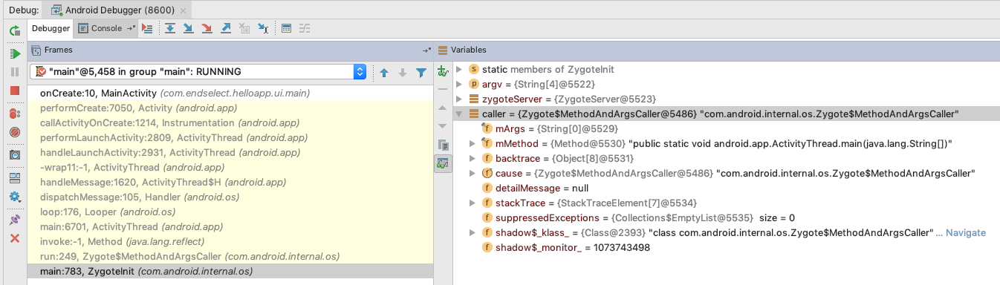

# The Journey of Launching An Android Activity
原文链接 https://medium.com/@Myyousseff/the-journey-of-launching-an-android-activity-9b64e11dc157

Android开发中，启动Activity是最常见的操作，启动一个Activity过程到底发生了什么呢？让我们一探究竟。

## Zygote

新建一个MainActivity，重写onCreate()方法，在onCreate()中打上断点，启动MainActivity，运行到断点处。得到如下截图：



在Debugger Frames最下面可以看到调用了ZygoteInit。

Zygote进程是Android的核心进程，由init进程（Linux所有的进程都是init进程的子孙进程）启动。Zygote进程启动时会初始化并运行虚拟机，会预加载所需要的类和资源，然后启动一个SystemServer进程，SystemServer进程负责初始化核心services，其中一个我们比较感兴趣的进程是ActivityManagerService。

## ActivityManagerService

ActivityManagerService负责创建Activity进程，管理Activity生命周期和Activity栈。它的启动过程可以分为三个主要步骤：

### 1- Collect Target Activity Information

收集目标Activity信息

```Java
private ActivityInfo resolveActivityInfo(Intent intent, int flags, int userId) {
    ActivityInfo ai = null;
    ComponentName comp = intent.getComponent();
    try {
        if (comp != null) {
            // Factory test.
            ai = AppGlobals.getPackageManager().getActivityInfo(comp, flags, userId);
        } else {
            ResolveInfo info = AppGlobals.getPackageManager().resolveIntent(
                    intent,
                    intent.resolveTypeIfNeeded(mContext.getContentResolver()),
                    flags, userId);
```
<small>[完整实现](https://android.googlesource.com/platform/frameworks/base/+/4f868ed/services/core/java/com/android/server/am/ActivityManagerService.java#3334)</small>

通过调用`resolveIntent()`收集目标Activity信息，完成之后将Activity信息保存起来避免重做这个步骤。

### 2- Check User Privileges

检查用户权限

```Java
try {
    targetUid = pm.getPackageUid(targetPkg, MATCH_DEBUG_TRIAGED_MISSING, targetUserId);
} catch (RemoteException ex) {
    return;
}

targetUid = checkGrantUriPermissionLocked(callingUid, targetPkg, grantUri, modeFlags, targetUid);
if (targetUid < 0) {
    return;
}

grantUriPermissionUncheckedLocked(targetUid, targetPkg, grantUri, modeFlags, owner);
```
这一步检查用户是否有权限启动目标Activity。如下：

- 确定目标package有一个合法的UID
- 通过调用`checkGrantUriPermissionLocked()`方法检查是否有权限
- 最后调用`grantUriPermissionUncheckedLocked()`方法

### 3- Activity object Instantiation

初始化Activity对象，通过ActivityThread类来完成。

#### 3.1  Get The Environment Ready
准备环境

```Java

// Make sure we are running with the most recent config.
handleConfigurationChanged(null, null);

if (localLOGV) Slog.v(
    TAG, "Handling launch of " + r);

// Initialize before creating the activity
if (!ThreadedRenderer.sRendererDisabled) {
   GraphicsEnvironment.earlyInitEGL();
}
WindowManagerGlobal.initialize();
```

在`handleLaunchActivity()`方法中，初始化配置、图形环境和windowManager。

#### 3.2- Retrieve The Previously Collected Information

获取之前收集的Activity信息

```Java
ComponentName component = r.intent.getComponent();
if (component == null) {
    component = r.intent.resolveActivity(
       mInitialApplication.getPackageManager());
    r.intent.setComponent(component);
}

if (r.activityInfo.targetActivity != null) {
    component = new ComponentName(r.activityInfo.packageName,
            r.activityInfo.targetActivity);
}

ContextImpl appContext = createBaseContextForActivity(r);
```

获取已经收集的Activity信息并创建baseContext。

#### 3.3- The Instantiation

实例化Activity

```Java
public @NonNull Activity instantiateActivity(@NonNull ClassLoader cl, @NonNull String className,
        @Nullable Intent intent)
        throws InstantiationException, IllegalAccessException, ClassNotFoundException {
    return (Activity) cl.loadClass(className).newInstance();
}
```
最后，通过Java反射实例化Activity。

实例化完成后，ActivityThread调用`callActivityOnCreate()`方法，开启Activity生命周期。

## 总结
这个过程讲的比较简陋，我们大概知道了几个概念，Zygote、ActivityManagerService、ActivityThread。后面我们再分享一篇文章详细分析Activity的启动过程。敬请期待！！
