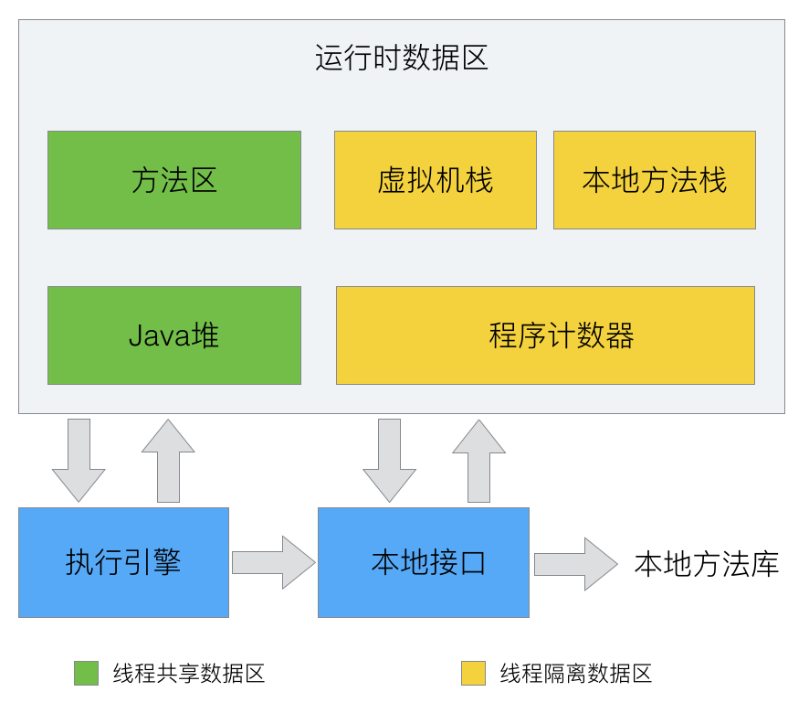

# Java内存区域

参考:

- 周志明老师的《深入理解Java虚拟机》
- 博客 https://mp.weixin.qq.com/s/-whyNqFX3baaUrpOLVoKVA

## 运行时数据区

Java虚拟机在执行Java程序的过程中会把它所管理的内存区域划分为若干个不同的数据区域。如下图：

### 程序计数器
程序计数器（Program Counter Register）是一块较小的内存空间，它可以看作是当前线程所执行的字节码的行号指示器。在虚拟机的概念模型里，字节码解释器工作时就是通过改变这个计数器的值来选取下一条需要执行的字节码指令，分支、循环、跳转、异常处理、线程恢复等基础功能都需要依赖这个计数器来完成。

由于Java虚拟机的多线程是通过线程轮流切换并分配处理器执行时间的方式来实现的，在任何时刻，一个处理器（对于多核处理器来说就是一个内核）都只会执行一个线程中的指令。为了线程切换后能恢复到正确的执行位置，每个线程都需要一个独立的程序计数器，各个线程的程序计数器互不影响，是线程私有区域。

### Java虚拟机栈

Java虚拟栈（Java Virtual Machine Stack）也是线程私有。虚拟栈描述的是方法执行的内存模型：每个方法在执行的同时都会创建一个栈帧（Stack Frame），用于存储局部变量表、操作数栈、动态链接、方法出口等信息。每个方法从调用直至执行完成过程，就对应着一个栈帧在虚拟机栈入栈到出栈的过程。

 局部变量表存放了编译期可知的各种基本数据类型（boolean、byte、char、short、int、float、long、double）、对象引用（reference类型，不等同于对象本身，可能是一个指向对象起始地址的引用指针，也可能是指向一个代表对象的句柄或者其他与此对象相关的位置）和returnAddress类型（指向了一条字节码指令的地址）。

 ### 本地方法栈
 和虚拟栈类似，虚拟机栈为虚拟机执行的Java方法服务，本地方法栈为虚拟机使用的Native方法服务。属于线程私有内存。

 ### Java堆

 对于大多数应用来说，Java堆（Java Heap）是Java虚拟机所管理的内存中最大的一块。Java堆是被所有线程共享的内存区域，在虚拟机启动时创建。此内存区域的唯一目的就是存放对象实例，几乎所有的对象实例都在这里分配。Java堆是垃圾收集器管理的主要区域，很多时候被称为GC堆。

 ### 方法区

 方法区（Method Area）和Java堆一样，是各个线程共享的内存区域，它用于存储已被虚拟机栈加载的类信息、常量、静态变量、即时编译器编译后的代码等数据。
 
 - 运行时常量池（Runtime Constant Pool）是方法区的一部分。Class文件中除了有类的版本、字段、方法、接口等描述信息外，还有常量池用于存放编译期生成的各种字面量和符号引用，这部分内容将在类加载后进入方法区的运行时常量池存放。

